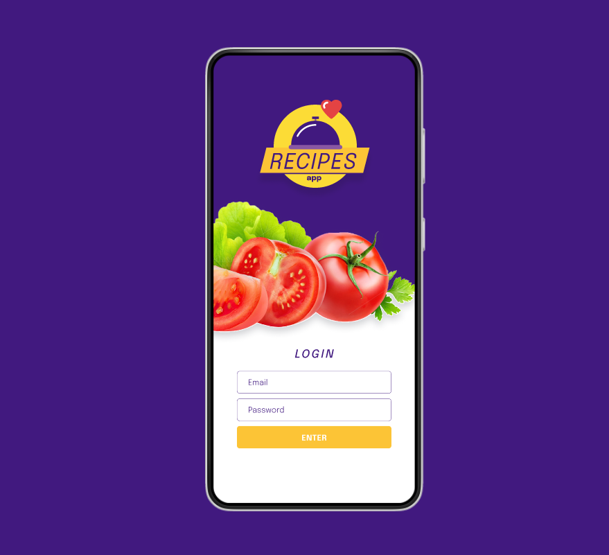
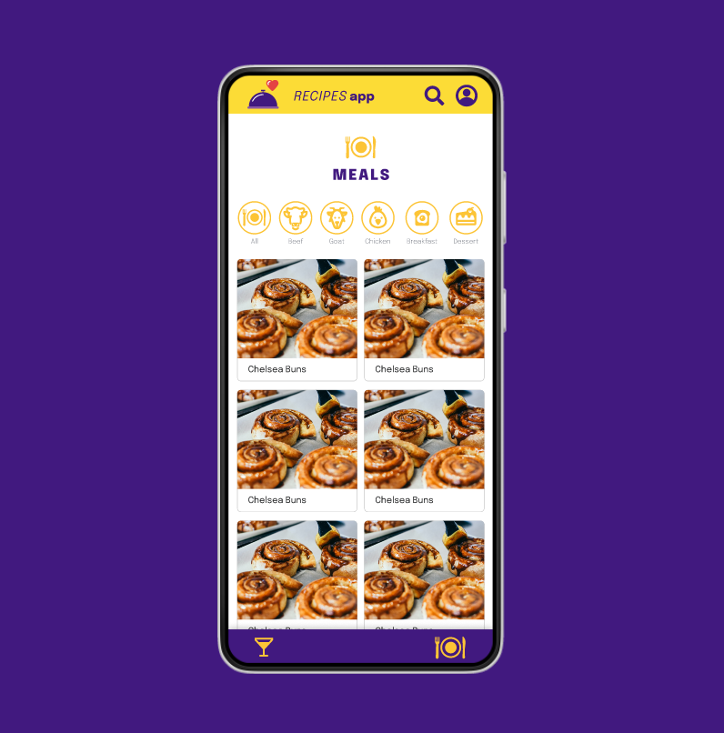
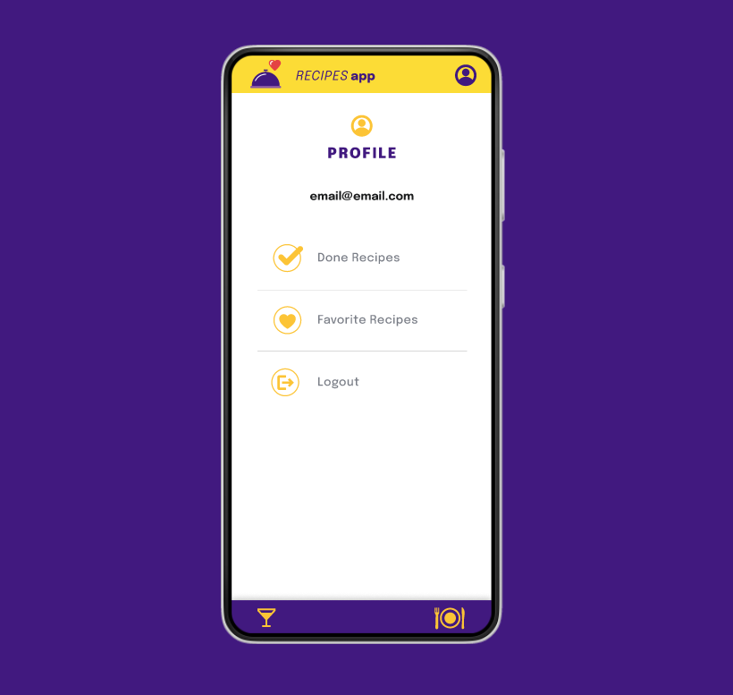

# Boas-vindas ao repositório do projeto de App-de-receitas!

  
<strong>👨‍💻 O que eu desenvolvi</strong>

   

  Eu desenvolvi em grupo um app de receitas, utilizando o que há de mais moderno dentro do ecossistema React: Hooks e Context API!

  Nele será possível: ver, buscar, filtrar, favoritar e acompanhar o progresso de preparação de receitas de comidas e bebidas!

  ⚠️ A base de dados serão 2 APIs distintas, uma para comidas e outra para bebidas.

  O layout tem como foco dispositivos móveis, dessa forma todos os protótipos vão estar desenvolvidos em telas menores.
   
  aqui o link do projeto no figma(https://www.figma.com/file/9WXNFMewKRBC5ZawU1EXYG/%5BProjeto%5D%5BFrontend%5D-Recipes-App?type=design)

 

  
<strong>Habilidades Adquiridas ao realizar este projeto</strong>
 

  Nesse projeto, eu fui capaz de:

  - Utilizar _Redux_ para gerenciar estado
  - Utilizar a biblioteca _React-Redux_
  - Utilizar a Context API do _React_ para gerenciar estado
  - Utilizar o _React Hook useState_
  - Utilizar o _React Hook useContext_
  - Utilizar o _React Hook useEffect_
  - Criar Hooks customizados

 
 
 

 
 

 
 

 
 

